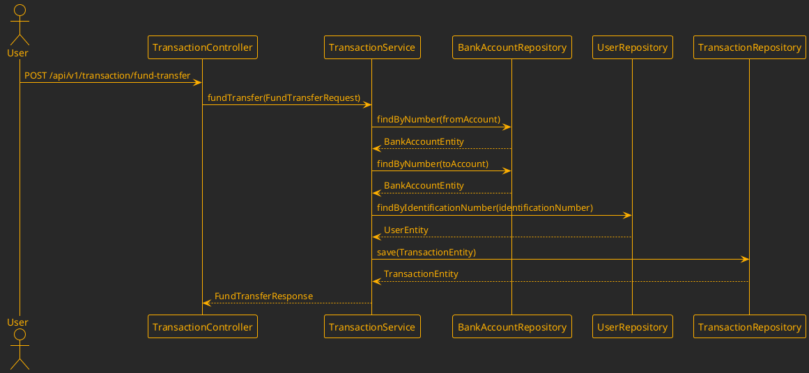
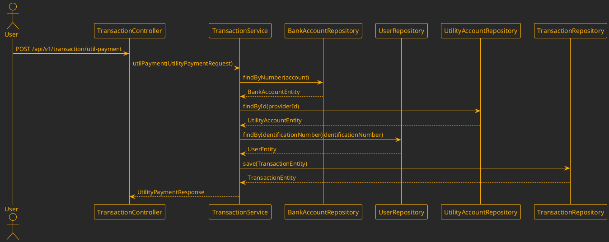
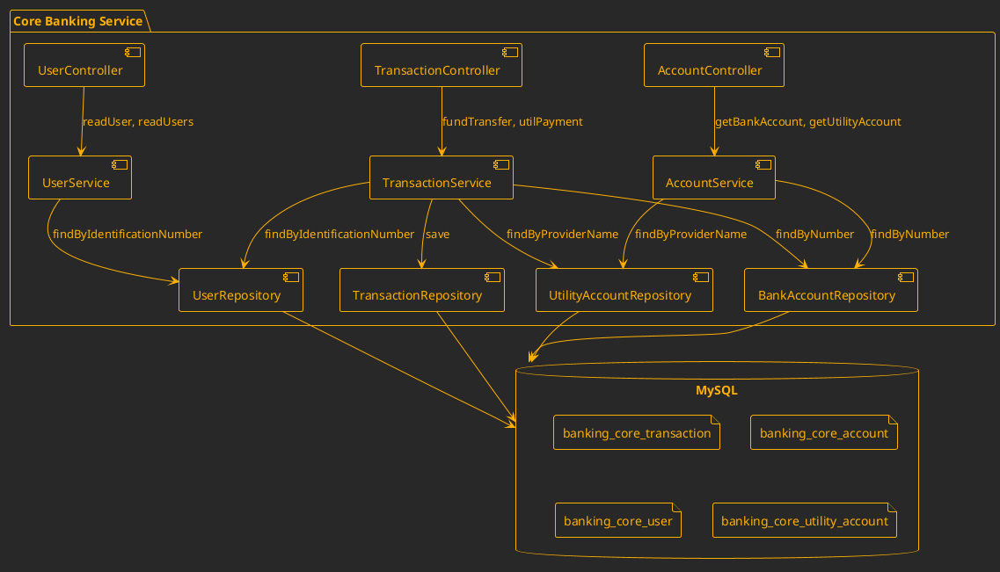
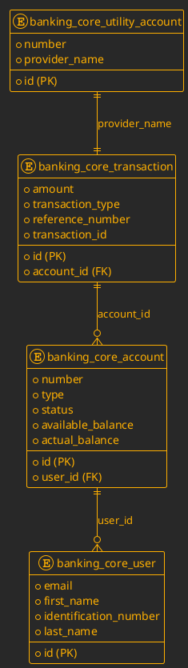

architect.md

# Core Banking Service Architecture Documentation

## Table of Contents
1. [System Overview](#system-overview)
2. [Class Diagram](#class-diagram)
3. [Sequence Diagrams](#sequence-diagrams)
4. [Component Diagram](#component-diagram)
5. [API Documentation](#api-documentation)
6. [Setup Instructions](#setup-instructions)
7. [Database Schema](#database-schema)

## System Overview
The Core Banking Service is a Spring Boot application designed to handle core banking functionalities such as fund transfers, utility payments, user management, and account management. It uses JPA for database interactions and MySQL as the database.

## Class Diagram

```plantuml
@startuml
!theme crt-amber

class TransactionController {
    +fundTransfer(FundTransferRequest): ResponseEntity
    +utilPayment(UtilityPaymentRequest): ResponseEntity
}

class UserController {
    +readUser(String): ResponseEntity
    +readUsers(Pageable): ResponseEntity
}

class AccountController {
    +getBankAccount(String): ResponseEntity
    +getUtilityAccount(String): ResponseEntity
}

class TransactionService {
    +fundTransfer(FundTransferRequest): FundTransferResponse
    +utilPayment(UtilityPaymentRequest): UtilityPaymentResponse
    -internalFundTransfer(BankAccount, BankAccount, BigDecimal): String
    -validateBalance(BankAccount, BigDecimal): void
}

class UserService {
    +readUser(String): User
    +readUsers(Pageable): List<User>
}

class AccountService {
    +readBankAccount(String): BankAccount
    +readUtilityAccount(String): UtilityAccount
    +readUtilityAccount(Long): UtilityAccount
}

class TransactionRepository {
    +findByNumber(String): Optional<TransactionEntity>
}

class BankAccountRepository {
    +findByNumber(String): Optional<BankAccountEntity>
}

class UserRepository {
    +findByIdentificationNumber(String): Optional<UserEntity>
}

class UtilityAccountRepository {
    +findByProviderName(String): Optional<UtilityAccountEntity>
}

class TransactionEntity {
    -id: Long
    -amount: BigDecimal
    -transactionType: TransactionType
    -referenceNumber: String
    -transactionId: String
    -account: BankAccountEntity
}

class BankAccountEntity {
    -id: Long
    -number: String
    -type: AccountType
    -status: AccountStatus
    -availableBalance: BigDecimal
    -actualBalance: BigDecimal
    -user: UserEntity
}

class UserEntity {
    -id: Long
    -firstName: String
    -lastName: String
    -email: String
    -identificationNumber: String
    -accounts: List<BankAccountEntity>
}

class UtilityAccountEntity {
    -id: Long
    -number: String
    -providerName: String
}

class FundTransferRequest {
    +fromAccount: String
    +toAccount: String
    +amount: BigDecimal
}

class UtilityPaymentRequest {
    +providerId: Long
    +amount: BigDecimal
    +referenceNumber: String
    +account: String
}

class FundTransferResponse {
    +message: String
    +transactionId: String
}

class UtilityPaymentResponse {
    +message: String
    +transactionId: String
}

class ErrorResponse {
    +code: String
    +message: String
}

TransactionController --> TransactionService
UserController --> UserService
AccountController --> AccountService

TransactionService --> BankAccountRepository
TransactionService --> UserRepository
TransactionService --> UtilityAccountRepository
TransactionService --> TransactionRepository

UserService --> UserRepository

AccountService --> BankAccountRepository
AccountService --> UtilityAccountRepository

@enduml
```


## Sequence Diagrams
**Fund Transfer:**


**Utility Payment:**


## Component Diagram


## API Documentation
| Endpoint | HTTP Method | Path | Request Format | Response Format | Description |
|----------|-------------|------|----------------|-----------------|-------------|
| /api/v1/transaction/fund-transfer | POST | - | FundTransferRequest | FundTransferResponse | Initiate a fund transfer. |
| /api/v1/transaction/util-payment | POST | - | UtilityPaymentRequest | UtilityPaymentResponse | Initiate a utility payment. |
| /api/v1/user/{identification} | GET | identification | - | User | Read user details by identification number. |
| /api/v1/user | GET | - | - | List<User> | Read all users. |
| /api/v1/account/bank-account/{account_number} | GET | account_number | - | BankAccount | Read bank account details by account number. |
| /api/v1/account/util-account/{account_name} | GET | account_name | - | UtilityAccount | Read utility account details by provider name. |

## Setup Instructions
1. **Clone the repository:**
   ```sh
   git clone <repository-url>
   cd core-banking-service
   ```

2. **Build the project:**
   ```sh
   ./gradlew build
   ```

3. **Run the application:**
   ```sh
   ./gradlew bootRun
   ```

4. **Database Configuration:**
   - Ensure MySQL is running.
   - Update `application.yml` with database credentials if necessary.

## Database Schema


## PlantUML Integration
- **Rendering Instructions:**
  - Use a PlantUML server like [PlantUML Online](http://www.plantuml.com/plantuml) to render the diagrams.
  - Copy and paste the PlantUML code into the server.

## Output
The documentation is structured with clear sections, including class diagrams, sequence diagrams, component diagrams, API documentation, setup instructions, and database schema. Each section is designed to be beginner-friendly and provides detailed explanations for new developers.

## Validation
- **Diagrams:** All PlantUML code is syntactically correct and should render properly on a PlantUML server.
- **Configuration Files:** No sensitive data from configuration files is included in the documentation.
```
